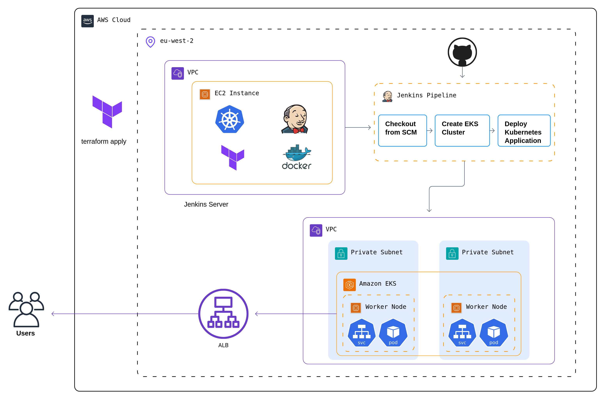

# 1. End-to-End EKS Deployment with Jenkins CI/CD & Terraform

[](https://www.terraform.io/)
[](https://aws.amazon.com/)
[](https://www.jenkins.io/)
[](https://kubernetes.io/)
[](https://opensource.org/licenses/MIT)
- [1. End-to-End EKS Deployment with Jenkins CI/CD \& Terraform](#1-end-to-end-eks-deployment-with-jenkins-cicd--terraform)
  - [1.1. Overview](#11-overview)
  - [1.2. Architecture](#12-architecture)
  - [1.3. Features](#13-features)
  - [1.4. Project Structure](#14-project-structure)
  - [1.5. Prerequisites](#15-prerequisites)
    - [1.5.1. Required Tools](#151-required-tools)
    - [1.5.2. Other Requirements](#152-other-requirements)
  - [1.6. Setup Instructions](#16-setup-instructions)
    - [1.6.1. Initial Setup](#161-initial-setup)
    - [1.6.2. Jenkins Setup](#162-jenkins-setup)
    - [1.6.3. EKS Cluster Deployment](#163-eks-cluster-deployment)
    - [1.6.4. Jenkins Pipeline Configuration](#164-jenkins-pipeline-configuration)
  - [1.7. CI/CD Pipeline Stages](#17-cicd-pipeline-stages)
  - [1.8. Security Considerations](#18-security-considerations)
  - [1.9. Monitoring and Logging](#19-monitoring-and-logging)
  - [1.10. Troubleshooting](#110-troubleshooting)
  - [License](#license)
  - [Future Improvements](#future-improvements)


## 1.1. Overview
This project demonstrates a full Infrastructure-as-Code (IaC) and CI/CD workflow using Terraform, Jenkins, and AWS EKS. It automates the provisioning of a Jenkins server on EC2, an EKS cluster, and the deployment of a sample Nginx application.

## 1.2. Architecture



## 1.3. Features
- **Infrastructure as Code**: Complete AWS infrastructure provisioning using Terraform
- **Containerized Deployments**: Kubernetes-based container orchestration
- **Automated CI/CD**: Jenkins pipeline for automated builds and deployments
- **High Availability**: EKS managed node groups for reliable container hosting
- **Security**: Properly configured VPCs, security groups, and IAM roles
- **Scalability**: Easy scaling with Kubernetes

## 1.4. Project Structure
```
.
├── terraform/
│   ├── ec2-jenkins/    # Terraform configs for Jenkins EC2 instance
│   └── eks-cluster/    # Terraform configs for EKS cluster
├── manifests/          # Kubernetes deployment manifests
├── scripts/           # Installation and setup scripts
├── Jenkinsfile        # CI/CD pipeline definition
└── README.md
```

## 1.5. Prerequisites

### 1.5.1. Required Tools
- Terraform >= 1.5.0 (compatible with AWS provider >= 5.25.0)
- AWS CLI >= 2.0.0
- Git >= 2.0.0

### 1.5.2. Other Requirements
- AWS account with appropriate permissions.
- GitHub repository with the project code.

## 1.6. Setup Instructions

### 1.6.1. Initial Setup
```bash
# Clone the repository
git clone https://github.com/of1r/terraform-eks-jenkins.git
cd terraform-eks-jenkins

# Configure AWS credentials
aws configure
```

### 1.6.2. Jenkins Setup
1. Navigate to terraform/ec2-jenkins directory
2. Update variables in terraform.tfvars
3. Run Terraform commands:
```bash
terraform init
terraform plan
terraform apply
```

### 1.6.3. EKS Cluster Deployment
1. Navigate to terraform/eks-cluster directory
2. Update cluster configuration in variables.tf
3. Deploy using Terraform:
```bash
terraform init
terraform plan
terraform apply
```

### 1.6.4. Jenkins Pipeline Configuration
1. Access Jenkins UI using the EC2 public IP
2. Install required plugins (AWS, Kubernetes, Pipeline)
3. Configure AWS credentials in Jenkins
4. Create and configure the pipeline job
5. Run the pipeline

## 1.7. CI/CD Pipeline Stages
1. **Code Checkout**: Pull latest code from repository
2. **Infrastructure Validation**: Run Terraform plan
3. **Infrastructure Deployment**: Apply Terraform changes
4. **Application Deployment**: Deploy to EKS cluster
5. **Health Checks**: Verify deployment status

## 1.8. Security Considerations
- AWS resources are deployed in private subnets
- Security groups are configured with minimal required access
- IAM roles follow the principle of least privilege
- Secrets are managed through AWS Secrets Manager
- Network policies are implemented for pod-to-pod communication

## 1.9. Monitoring and Logging
- EKS control plane logging enabled
- CloudWatch container insights

## 1.10. Troubleshooting
- Check Jenkins logs for pipeline failures
- Verify AWS credentials and permissions
- Ensure correct kubectl context
- Review EKS cluster status and logs
- Check security group configurations

3. **Usage**:
   - Trigger the Jenkins pipeline to provision infrastructure and deploy the application.
   - Monitor the pipeline logs for deployment status.

## License
This project is licensed under the MIT License - see the LICENSE file for details.

## Future Improvements
- Add automatic triggers for the Jenkins pipeline on code pushes.
- Implement testing stages in the pipeline.
- Add monitoring and logging solutions.
